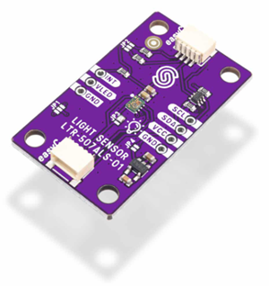
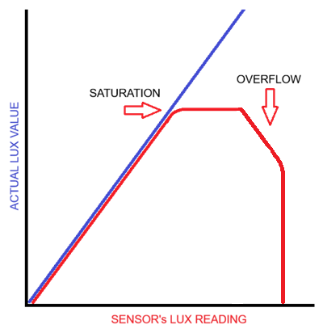
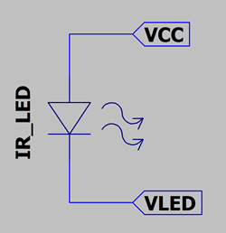

# LTR507ALSOpticalSensor

## Arduino Library for LTR-507ALS Optical Sensor



The LTR-507 has a couple of problems (see below) and LiteOn is not advertising it anymore. Maybe that's why these modules are cheap. The more recent LiteOn chips are better, like the improved LTR-329.

This 3.3V chip has two functions, an Ambient Light Sensor (ALS) and a Proximity Sensor (PS). It computes the (hopefully accurate) lux value internally, so you don't need any dubious code to do the job. It also has a fully programmable interrupt pin (INT), which can signal the MCU when the light level is outside, or inside, a programmed range. It has two sensors, one for visible and infrared light (channel 1, CH1), and another for only (mostly) infrared light (channel 2, CH2). The lux value (the light level visible to the human eye) is calculated from channel 1 by removing the infrared component of channel 2.

The chip contains 33 registers, making it rather complicated to program. For full details you must read the data sheet (several times), but reading my code and the copious comments will help a lot. This chip seems to have been discontinued by LiteOn (it's not on their website anymore), and the more recent chips (LTR-3xx etc) have fewer registers and seem to be easier to use. The more recent chips do not seem to be available on easy-to-use modules.

The ALS and PS features can be enabled (activated) or disabled (disabled = standby, the power-on default, which saves power if its battery operated). The ALS feature has a programmable gain, bit resolution and sampling rate, see `configureALS()`. intuitively, the PS feature is configured with `configurePS()`. The interrupt behaviour and threshold light levels can also be programmed. Always configure the interrupts BEFORE activating ALS or PS. See the comments in the code for details.

There are four gain settings (1x = 1 lux/count; 2x = 0.5 lux/count; 100x = 0.01 lux/count; 200x = 0.005 lux/count), which can be selected during operation to adjust the the lux value range according to the light level, and prevent saturation.

## Saturation

Digital saturation occurs when the light intensity is too high for the internal calculation. Analog saturation occurs when the level is too high for analog-to-digital converter. With a high gain setting this can happen at quite low light levels.

With 1x gain, the lux reading goes up to the maximum 65535 and stays there. With 2x gain, the maximum is 32767 lux, with 100x gain it is 655, and 200x is 327. If the level goes too much above the max. level, it drops to zero, which is not good.

To complicate things, each of the two sensors has a different saturation level. The full spectrum sensor is more susceptible to visible light and the IR sensor saturates when there's high infrared light. The LTR-507 also has trouble with lux calculation if the IR component of the light is too high, see next section on high levels of infrared.

I think there's a problem with the chip's handling of saturation. If the level goes up to the maximum value according to the gain, it stays at that value until overflow occurs, then it sets the lux value to 0. As the light level increases, the lux reading begins to drop for a while before saturation is recognised and the reading is set to zero. This could be due to arithmetic overflow in the on-chip calculations. I think this is why they added the `ALS_IRF_CUT_OFF` register, see next section.



If the lux value is 0, how do we know it is because of saturation or because there is no light and 0 lux is the correct value? If at the maximum level, how do we know if the internal calculation has overflowed? Unfortunately, the LTR-507 does not have an "overflow" or "saturation" bit for the lux value (it's only for the PS value). But the muman library has added features which handle both these situations...

If the raw lux reading is zero, it checks the channel 0 analog reading. If that is also zero then it assumes no light and returns 0 lux. But if the channel 0 reading is not zero, it means that overflow has occurred and it returns an impossible lux reading of -1.

If the raw lux value is the maximum value of 65535, the code checks the channel 0 value for overflow. I'm not sure exactly what value to check for, and it's affected by the gain setting. But I found that checking the most significant 4 bits (bits 19..16) for the value 1111 (0x0f) works well for all gain settings. If the MS 4 bits are all 1s, then it returns -1.

Both these checks are done in the `readRawLux()` method.

## High levels of infrared light produce invalid lux readings

The LTR-507 sensor does not handle very high levels of infrared light well. The lux reading actually decreases for a while if the IR component becomes too high. They added a feature to handle this. You can configure a ratio between channel 1 and 2 with `configureALSIRFCutoff()`, which sets a maximum level for the infrared component. The default value for the `ALS_IRF_CUT_OFF` register is 0xD0 (208). If the IR levels are high and the `ALS_IRF_CUT_OFF` value is exceeded, the reading is set to 0 lux, and both analog channels are set to 0 too.

This feature is annoying because it sets the lux reading to 0 even for quite low light levels from an incandescent spot lamp (100W), and it's impossible to tell the difference between darkness and IR saturation. There is no way to turn off this feature.

I think the description in the data sheet is incorrect...

It says, "if ADCIR / ADCCLEAR > ALS_IRF_CUT_OFF, then ALS_DATA = 0". \
I think this should be, "if (256 * ADCIR) / ADCCLEAR > ALS_IRF_CUT_OFF, then ALS_DATA = 0".

In my tests "* 256" worked very well. You can test this yourself using an incandescent light bulb, these emit a lot of infrared. (But avoid touching the live wire, see Disclaimer.)

Ref. data sheet section 6.16 ALS_IRF_CUT_OFF Register (0x97): \
https://optoelectronics.liteon.com/upload/download/DS86-2013-0014/LTR-507ALS-01_FINAL%20DS.pdf#page=26

The ALS_IRF_CUT_OFF register does not seem to exist in later sensors from LiteOn.

## Automatic Gain Selection

The code contains a unique function called autoSelectGain(long lux) which automatically sets the optimal gain (x1 .. x200) for the lux value returned by readLux(). It returns true if the gain was changed. If saturation or overflow has occurred (lux = -1) it will set the range to 0 (0..65535 lux, the default), so the next read will (hopefully) return a valid value. See the example sketch.

The code could be modified to switch between only two gain settings instead of four, e.g. 1x for high lux values (0..65535) and 200x for low lux values (0..326). This may make more sense.

## I2C Slave Address

The address is selected by connecting the SEL pin to GND, VCC or leaving it floating. See JP3.
Note that the Address Selection section on the SolderedElectronics website is wrong!

| SEL      | I2C Address |
|:---------|:---------   |
| GND      | 0x3A (default for my SolderedElectronics board) |
| VCC (3.3V) | 0x3B |
| floating | 0x23 |

## Proximity Sensor's External IR LED

The Proximity Sensor (PS) requires an external infrared LED to be connected. It flashes the IR LED at a programmed rate. You can program the pulse frequency, peak current and pulse count with `configurePS()`. The reflected IR light determines the distance of an object, depending on its IR reflectivity. The distance is returned as an arbitrary value by readProximity(). This value is not in mm or cm, it's just the ADC value, so it must be calibrated/converted if you need an actual distance.

Connect the IR LED between the VLED output and VCC (+3.3V). The LED is turned on when the VLED output is pulled to GND by the chip. The LED current is limited by peakCurrent, so you don't need a series resistor.



The `readProximity()` method returns the proximity detection distance as the raw ADC CH2 value (it's not cm or mm). The value increases as the distance decreases. The detection range is about 5..20cm, depending on reflectivity. overflow is set if the reflector is too close (<5cm) and the ADC value has overflowed (>2047).


## Class Reference

The C++ code was written and tested on a 32-bit STM32 Nucleo board, but it should run on most Arduino-style boards with minimal changes. My version provides more features than the official library, and I think it's easier to understand thanks to the copious comments. The code uses uint and ulong, the standard abbreviations for unsigned int and unsigned long. On a 32-bit device these are both 32-bit values. On a 16-bit device, uint is 16 bits and ulong is 32 bits, but everything should work for both.

The code detects saturation when the lux value overflows the gain setting, or if there's too much infrared light. If the lux register value is 0 (`ALS_DATA` = 0) and the ADC register CH1 is not zero, the code returns a negative lux value (-1) so you can tell the difference between an invalid reading and total darkness. The other libraries do not seem to detect this. This also returns -1 if the `ALS_IRF_CUT_OFF` level is exceeded.

```cpp
class LTR507ALSOpticalSensor
{
public:
	bool begin(TwoWire* wire, int i2cAddress);
	bool softwareReset();
	bool readIDs(uint* partNumberID, uint* revisionID, uint* manufacturerID);
	bool setMode(bool alsActive, bool psActive);
	
	bool readLux(long* lux, bool* newData);
	bool readLux(float* lux, bool* newData);
	bool readRawLux(long* lux, bool* newData);
	bool readProximity(uint* proximity, bool* overflow);
	bool readStatus(uint* interruptSource, bool* alsInterruptStatus, 
		bool* alsDataStatus, bool* psInterruptStatus, bool* psDataStatus);
	bool readRawAdcValues(ulong* adcCh1, ulong* adcCh2);
	bool autoSelectGain(long lux);
	
	bool configureALS(uint gain, uint resolution, uint rate);
	bool configurePS(uint pulseFreq, uint peakCurrent, uint pulseCount, uint rate);
	bool configureInterrupt(bool outputMode, bool polarity, uint interruptMode);
	bool configureALSCoeff(uint coeffCh1, uint coeffCh2);
	bool readALSCoeff(uint* coeffCh1, uint* coeffCh2);
	bool configureALSInterruptThreshold(uint upper, uint lower);
	bool readALSInterruptThreshold(uint* upper, uint* lower);
	bool configurePSInterruptThreshold(uint upper, uint lower);
	bool readPSInterruptThreshold(uint* upper, uint* lower);
	bool configureInterruptPersist(uint alsPersist, uint psPersist);
	bool readInterruptPersist(uint* alsPersist, uint* psPersist);
	bool configureALSIRFCutoff(uint cutoff);
	bool readALSIRFCutoff(uint* cutoff);
};
```

```cpp
// for uint and ulong 
typedef unsigned int uint;
typedef unsigned long ulong;
```


 

## References

**LTR-507ALS data sheet** \
https://optoelectronics.liteon.com/upload/download/DS86-2013-0014/LTR-507ALS-01_FINAL%20DS.pdf

Here's the overview of the module on the SolderedElectronics website. On the left of the window you will see a table-of-contents where you can view the Overview, Hardware Details, How It Works, and their own Arduino Library (but my library is better ;-) \ 
https://soldered.com/documentation/ltr-507/overview/

This is the SolderedElectronics library for this chip. The same code is used for the "official" Arduino library. \
https://github.com/SolderedElectronics/Soldered-Digital-Light-Sensor-Arduino-Library/tree/main/src \
https://docs.arduino.cc/libraries/soldered-ltr-507-arduino-library/

I did not find any other libraries for this chip and it's no longer advertised on their website. However, LiteOn has a lot of new light sensors, which seem very good... \
https://optoelectronics.liteon.com/upload/media/service/Publications/2017OpticalSensor/2017OpticalSensor.pdf \
https://optoelectronics.liteon.com/en-global/Led/LED-Component/Detail/926

Some LiteOn sensors can even detect the light intensity for different colors. This one contains 5 sensors for different wavelengths \
https://optoelectronics.liteon.com/upload/download/DS86-2018-0007/LTR-381RGB-01_Final_DS_V1.8.PDF


## Revision History

| Date  | Revision | Description |
|:---------- |:---------|:----------- |
| 2026.09.23 | 0.0.0	| Preliminary |

<br/>


## Joke of the Week


